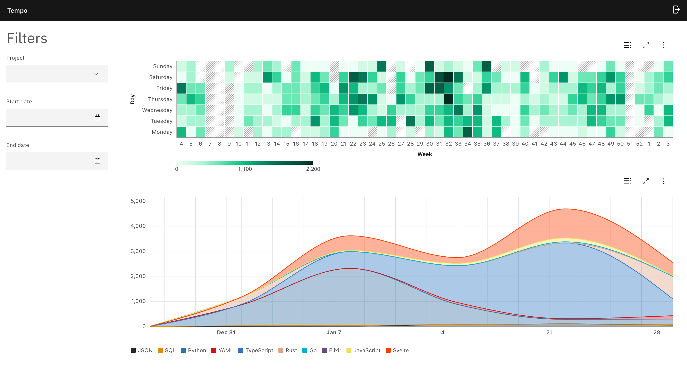

# Tempo

>**Time**: the indefinite continued progress of existence and events in the past, present,
>and future

This is an implementation of a Wakatime compatible backend written in Rust. It also includes
a frontend application written in TypeScript with React and Next.js to show some charts
to interpret the recorded activity.

It supports creating users, generating API tokens and recording heartbeats in the database.

It also partially implements the status bar endpoint, enough to show the activity in VSCode's
menu bar.

This project is definitely not feature complete, so if you found this while looking for
a self-hostable backend compatible with Wakatime plugins, you might want to also check out
[Hakatime](https://github.com/mujx/hakatime) and [Wakapi](https://github.com/muety/wakapi).

## User guide

### Initialize database

Tempo is built for usage with SQLite3. You can initialize a database with `make db`. This
command will create a database named `tempo.db` and apply the required migrations.

### Build and run application

Before proceeding, you are going to need to install the dependencies listed in
[.tool-versions](./.tool-versions). I use [mise](https://mise.jdx.dev/)
to manage runtimes, but you can use whatever you want.

At this point you can build the application. You can do this simply with `make build`.
It will take care of installing the required dependencies and building the frontend
application with `bun` before building the backend with `cargo`.

The frontend application is a SvelteKit application configured to output static files to be
embedded in the backend binary. This means that the backend binary is completely
self-contained and can be run without any additional files. Database migrations are also
baked into the binary, so you don't need to worry about running them manually.

You can then run the app with the following command:

```sh
./target/release/tempo
```

By default the app runs on port 8000, but you can configure it by setting the `-p/--port`
flag. For all options check the `--help` menu with

```sh
./target/release/tempo --help
```

### Create a user

Before you can start sending heartbeats, you need to create a user. You can do this by
visiting the `/signup` page. You will be asked to provide an email and password.

### Update .wakatime.cfg

After creating a user, you can update your `.wakatime.cfg` file to point to your Tempo
instance. You can do this by adding the following lines to your config file:

```toml
[settings]
status_bar_enabled = true
# the api_key will be generated on sign up
api_key = "waka_XXXXXXXX-XXXX-XXXX-XXXX-XXXXXXXXXXXX"
api_url = "http://127.0.0.1:8000/api/v1/users/current/heartbeats.bulk"
```

## Screenshots



## Roadmap/ideas

- [x] Implement authentication pages
- [ ] Add settings page where users can see their API key
- [ ] Allow users to merge projects' stats
- [ ] Add filter to exclude weekends from stats
... more?
